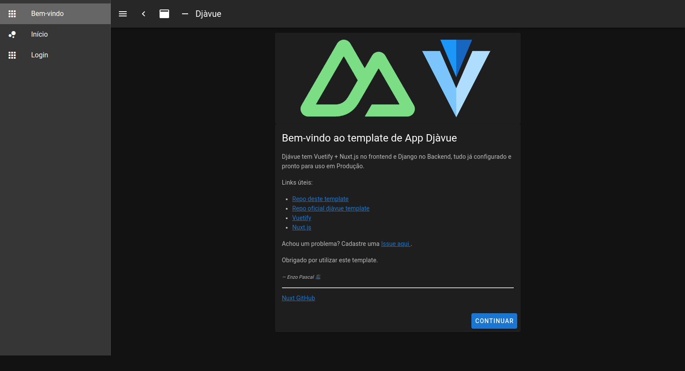

# d-jà vue

Um template de projeto completo **full-stack**, **pronto para produção**, com boas práticas e focado na produtividade. Combina um frontend (Vue|Nuxt.JS|Vuetify) e Backend Python (Django API)

## Por que?

Com mais de 20 anos trabalhando como web-developer, eu [Tony Lâmpada](https://github.com/tonylampada) descobri que fazendo do jeito certo, podemos ter muito mais chances de:

- Todos do time conseguirem ser mais produtivos com entregas mais rápidas focando no negócio
- Clientes mais felizes
- Produto final com mais qualidade e fácil de mudar

## O que está incluso?

- Ambiente baseado em containers (docker) e docker compose, início com mínimo de esforço
- Integração entre FRONTEND e BACKEND prontos para produção
- Autenticação configurada para funcionar com o Django (cookies)
- Estrutura de pastas para facilitar escalar e organizar o projeto
- Estilo de código configurados para o BACKEND (flake8) e FRONTEND (eslint)
- Exemplo funcional de um todo-list com listar/incluir
- BACKEND: [Django](https://www.djangoproject.com/) e Postgres
- BACKEND: Teste configurado com exemplos (usando [Pytest](https://docs.pytest.org/)) para promover TDD
- FRONTEND: [Vue 2](https://v2.vuejs.org/), [Vuetify](https://vuetifyjs.com/en/getting-started/quick-start) e [Nuxt](https://nuxtjs.org/) (usando vue cli) separado do backend
- FRONTEND: Modo sem backend usando [mock-apis](https://medium.com/@tonylampada/javascript-mock-api-why-you-might-want-to-have-one-232b3ba46b12) para promover a validação rápida de ideias



## Requisitos

- Node 14 instalado (digite `node -v` para ver a versão) e conseguir rodar o [vue-cli](https://cli.vuejs.org/)
- Docker & Docker compose instalados para subir tudo muito rápido e não precisar instalar/configurar infinitas libs/ferramentas diretamente na sua máquina

## Começando

Este é um template de projetos [Vue](https://cli.vuejs.org/guide/creating-a-project.html) que precisa do [vue-cli](https://cli.vuejs.org/).

Neste exemplo, vamos criar o projeto `mytodolist`, mas você pode trocar este nome para qual faz mais sentido para seu produto!

### Primeiro passo

Vamos precisar criar o projeto e fazer o build de tudo, utilize os comandos abaixo:

```bash
# Digite o comando abaixo, caso ainda não tenha o comando vue
$ npm install -g @vue/cli
# Crie o novo projeto usando o vue init
$ vue init evolutio/djavue mytodolist
$ cd mytodolist
# Para criar os containers
$ docker-compose build
# Para iniciar os containers
$ docker-compose up -d backend frontend
```

Depois de fazer o build e iniciar todos containers, fazendo um `docker ps` é possível ver que temos os seguintes serviços rodando:

```
$ docker ps
CONTAINER ID   IMAGE                  COMMAND                 NAMES
a72fb2ab3ba2   back-todoten           "wait-for-it localho…"  mytodolist_backend_1
6ef83aab15e5   front-todoten          "docker-entrypoint.s…"  mytodolist_frontend_1
6def45b54094   nginx                  "/docker-entrypoint.…"  mytodolist_nginx_1
93e76c660729   postgres:13.3-alpine   "docker-entrypoint.s…"  mytodolist_postgres_1

```

E estes containers estão organizados como no diagrama abaixo:


🚀 Para acessar os serviços, utilize as URLs abaixo:

- `http://localhost` para acessar o frontend
- `http://localhost/api` para acessar diretamente alguma rota da API
- `http://localhost/admin` para acessar o Django admin

📝 NOTA: Embora o frontend está em `http://localhost:3000`, não faz muito sentido acessar esta URL diretamente. Utilize `http://localhost` para acessar o front, desta forma o NGINX vai intermediar e saber redirecionar requisições feitas pelo frontend para `http://localhost/api`, ou seja, acessando com a porta 3000, as requisições /api não funcionam.

Para conseguir logar, vamos precisar criar um usuário no Django. Podemos fazer isto entrando no container backend e rodar o comando do Django `./manage.py createsuperuser`:

```
$ docker-compose exec backend ./manage.py createsuperuser

Usuário (leave blank to use 'root'): admin
Endereço de email: admin@example.com
Password:
Password (again):
Superuser created successfully.

```

📝 NOTA: Também podemos acessar diretamente o container do backend usando `docker exec -it mytodolist_backend_1 bash` e ai digitar o comando que quisermos, mas temos que ter atenção que o prefixo do nome do container muda conforme o nome dado na criação do projeto.

### Passo 2

Para preparar o ambiente para que seja possível evoluir o frontend, dado que algumas pastas foram geradas pelo processo de build do docker, vamos precisar fazer alguns ajustes:

```
# Mudar o dono da pasta de root para o seu usuário
$ sudo chown 1000:1000 -Rf frontend/
$ cd frontend
$ npm install

# Para garantir que tudo está funcionando, o comando abaixo tem que rodar sem dar erro:
$ npm run lint
  > frontend@1.0.0 lint /home/user1/workspace/mytodolist/frontend
  > npm run lint:js
  > frontend@1.0.0 lint:js /home/user1/workspace/mytodolist/frontend
  > eslint --ext ".js,.vue" --ignore-path .gitignore .

```

Se conseguiu ver a saída acima, tudo esta funcionando!

Para parar todos os containers, utilize o comando abaixo:

```
$ docker-compose down
  Stopping mytodolist_backend_1  ... done
  Stopping mytodolist_frontend_1 ... done
  Stopping mytodolist_nginx_1    ... done
  Stopping mytodolist_postgres_1 ... done
```

📝 NOTA: Utilize o comando `docker ps` e garanta que nenhum container está rodando

Para mais informações, siga o [README.md](template/README.md) que foi gerado dentro do seu projeto `mytodolist`

## Subindo apenas o frontend (backend-less)

Para algumas demandas de trabalho, faz sentido alterar primeiro o frontend, e assim não faz sentido subir
o backend com banco de dados. No Djàvue temos o conceito de API MOCK. ou seja, subir apenas o front com um imitador de backend (mock). Em ouras palavras, subir apenas código JavaScript e nada de Python ou qualquer outra tecnologia.

Para isto, ao invés de utilizar o `docker-compose up` apresentado no início, vamos utilizar uma pequena variação:

```bash

$ docker-compose -f docker-compose.yml -f docker-compose.apimock.yml up frontend

```

🚀 Para acessar os serviços, utilize as URLs abaixo:

- `http://localhost` para acessar o frontend
- `http://localhost/api` para acessar diretamente alguma rota da API MOCK

📝 NOTA: Rode um `docker ps` e veja que temos rodando um imitador de backend (que está na pasta `apimock`) em código NodeJS com [Express](https://expressjs.com/).

## Para mais informações sobre Djávue & API Mock

- [Djà vue: Uma jornada pelo desenvolvimento web com Django e Vue.js](https://evolutio.io/curso/djavue) - Curso gratuito
- [Javascript mock api — why you might want to have one](https://medium.com/@tonylampada/javascript-mock-api-why-you-might-want-to-have-one-232b3ba46b12)
- [Tutorial Djavue Python Brasil 2021 - Parte 1](https://www.youtube.com/watch?v=E8yTa7_IBu0&t) - Fazendo o setup sem Docker e no Windows
- [Tutorial Djavue Python Brasil 2021 - Parte 2](https://www.youtube.com/watch?v=U_1qHi8OdeI&t) - Fazendo o setup sem Docker e no Windows
- [Repositório do Djá vue na Python Brasil](https://github.com/buserbrasil/djavue-python-brasil) - Repo dos vídeos acima
- [Três formas de fazer mock da sua API com JavaScript | Entenda onde isto te ajuda](https://huogerac.hashnode.dev/tres-formas-de-fazer-mock-da-sua-api-com-javascript-or-entenda-onde-isto-te-ajuda)

## Contribuindo

Este é template de projeto que vem evoluindo desde do início de 2018, aceitamos sugestões e ficaremos muito felizes em saber a sua!
A melhor forma para promover uma mudança é criando uma [Issue aqui](https://github.com/evolutio/djavue/issues).

## CHANGELOG

### 2022-10-12 - v.2.0.0 - Atualizado para versões mais recentes do Django e VueJS

- Atualizado de Django 1.11 para 4.0
- Atualizado de Vuejs, vuetity e nuxt 1.0 para 2.6, Node 9 para 14
- Remove o dev.sh e passa a utilizar Docker Compose
- Muda API Mock para ao invés de utilizar a pasta apimock ou api (conforme variável API_MOCK), utiliza um simulador de Backend com NodeJS/Express
- Muda para subir modo com Backend Django ou modo com API MOCK conforme comando docker compose ao invés de subir tudo sempre
- Muda para utilizar vue-router implícito (padrão do Nuxt) ao invés da pasta router (\*\* sujeto a mudança)
- Adiciona Pytest nos testes do backend
- Ajustes nas configurações do Django conforme as políticas mais novas de segurança
- Adiciona Flake8 para linter do backend
- Adiciona mais regras para linter no frontend com Eslint

### 2019-11-28 - v.1.0.1 - Pequenos ajustes

- bugfixes
- fix de segurança
- habilitado PWA
- ajuste no show do snack

### 2018-06-05 - v.1.0.0 - Versão mais funcional

- Melhor documentação
- Melhor configurações para deploy
- Diversos bufixes

### 2018-03-18 - v.0.0.1 - Versão inicial

- Primeira versão lançada

## What are the good practices (or, how I like to do things):

### 1. Start by building a backend-less frontend

Software building is tricky, because it's too easy to end up creating the wrong software. To avoid that we need constant feedback about our partial progress. By using [mock-apis](https://medium.com/@tonylampada/javascript-mock-api-why-you-might-want-to-have-one-232b3ba46b12), we can deliver a "fake" piece of our application into the clients hands that looks and feels like the real thing. We know we'll make mistakes. Let us make them cheaply.

Mock apis go into `frontend/components/api/apimock.js` - just follow the patterns in there.
This is also a good time to write the equivalent AJAX calls inside `api.js` (to URLs that don't exist in the backend yet)

### 2. Start with the output

It's likely that the software you need to build will require input from the user, and give output to the user.
When we act in the world, we see **tools** and **obstacles**.
Your software will be a **tool** when the user gets valuable output from it.
And it will be an **obstacle** when the user has to input info to get the value that they want.

Input is cost. Output is value.

You should start by creating the fake screens (mockapi-based) for the output (value) part of your software. Validate that with the client. The result of that process will give you useful information that will orient the design of the next parts of your software, the input (cost).

### 3. Deploy early, deploy often

I like to setup my projects with two online live test-environments that will be deployed with every commit

- **fronttest**: runs the application using the mockapis
- **test**: runs the funn application

During the early stages of development, having the client validate things in the **fronttest** environment speeds up the feedback loop. A LOT.

This project will come with a `.gitlab-ci.yml` file. If you host your code in a private Gitlab instance, this should make it easier for you to deploy to "fronttest" and "test" to AWS by using [Gitlab continuous integration and deploy](https://about.gitlab.com/features/gitlab-ci-cd/)

### 4. TDD is the fastest way

When you have a mockapi, that code is not just junk that you don't need. On the contrary. It contains a **valuable, unambiguous specification of how your backend must behave**. At that point, the fastest way to build your backend is to look at your mock apis as an orienting guide for test cases.

Look at mock apis --> write tests --> implement the backend --> repeat
